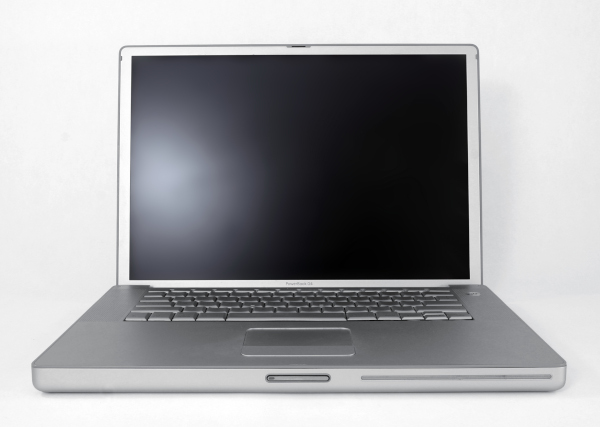

My dad has an old MacBook from 2001, a PowerBook G4 that's been just sitting collecting dust for years. He wanted to try and revive it to use it for casual web browsing. So I told him he could probably pull it off by putting Linux on it.

After some research, I found the best distribution for this would [Lubuntu](https://lubuntu.net/) as it has the following benefits:

* Low resource requirements
* PowerPC arch support
* User Friendly (especially helpful for a Baby Boomer whose only experience is with Macs)

## Initial setup

First Download Lubuntu for PowerPC at <https://lubuntu.net/downloads/>. The direct download link seems to be down so a torrent client is going to be needed. I recommend [webtorrent](http://webtorrent.io) as it's very user-friendly.

Next you'll need something to flash a USB, [balena etcher](https://www.balena.io/etcher/) is cross-platform and will suit our needs.

With balena installed you can select your drive, the ISO you downloaded via torrent and get flashing.

## Getting into PowerPC BIOS/boot menu

To get into the powerbook's bios you'll need to hold down this long combination after you turn on your mac `Cmd⌘ + Option/alt + O + F`.
After that you should be presented with a CLI with a white background.

## Selecting the boot medium

PowerBooks are old, thus they don't have a GUI based bios and instead use a CLI. Normally I love me a good CLI as they are much more powerful if you know what you're doing. Sadly this bios is not very user friendly with obscure commands and no user manual. After some digging I found the correct command to boot from USB.

**NB**: if you have a non-american keyboard, while in this CLI your keyboard layout
will default to the american layout so this might come in handy.


> *if your keyboard has a fat enter key, the | and \ key will instead be to the left of the enter key instead of above.*

For left usb port

```
boot usb0/disk@1:,\\yaboot
```

For right usb port

```
boot usb1/disk@1:,\\yaboot
```

> Just to ring home how obscure these commands are, `yaboot` is an argument thats needed if the OS is linux based. Meanwhile `tbxi` is for OSX based. Why? Beats me.

## Setting up Lubuntu

After these steps, you should boot into the trial of Lubuntu. From here you can experiment with the distro or install it via the desktop icon.

Following the install wizard should be easy enough.

And we're done! Enjoy your revived system.

> *Though if your G4 was like ours, 512mb of ram is going to be hard to work with, so be careful and setup a swap file or be prepared to reboot regularly when your system gets stuck when you run out of ram...*